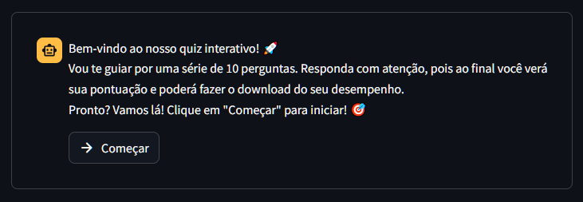

# ChatBot - Formulário Interativo com Streamlit




> Um chatbot interativo baseado em Streamlit, onde o usuário responde perguntas de um quiz e recebe um relatório em json de desempenho. O projeto utiliza Python, Streamlit e JSON.
  
## 💻 Pré-requisitos

Antes de começar, verifique se você atendeu aos seguintes requisitos:

- O projeto é compatível com Windows, Linux e macOS.
- Você instalou a versão do Python entre 3.9 e 3.13 ([python/downloads](https://www.python.org/downloads/)).
- Você instalou o Streamlit mais recente e leu a documentação ([streamlit.io/docs](https://streamlit.io/docs)).

## 🚀 Instalando ChatBot - Formulário Interativo

Para instalar o ChatBot, siga estas etapas:

1. Clone o repositório:

    ```bash
    git clone https://github.com/Didira123/chatbot-formulario.git
    ```
2. Crie e ative o ambiente virtual:

    ```bash
    python -m venv .venv
    
    # Windows command prompt
    .venv\Scripts\activate.bat

    # Windows PowerShell
    .venv\Scripts\Activate.ps1

    # macOS and Linux
    source .venv/bin/activate
    ```

3. Instale o Streamlit no seu ambiente virtual:

    ```bash
    pip install --upgrade streamlit
    ```

## ☕ Usando o ChatBot - Formulário Interativo

Para utilizar o **ChatBot - Formulário Interativo**, siga os passos abaixo:

1. Acesse a pasta do projeto no terminal.
2. Execute o arquivo `chatbot.py` com o seguinte comando:

    ```
    streamlit run chatbot.py
    ```


Isso abrirá o aplicativo **Streamlit** no seu navegador, permitindo que você interaja com o chatbot.

### Personalizando as Perguntas e Respostas

Se desejar personalizar as perguntas e respostas, basta editar o arquivo `questions.json`. Mantenha a estrutura do arquivo conforme o exemplo abaixo:

```json
{
    "question": "PERGUNTA",
    "correct_answer": "RESPOSTA_CORRETA",
    "options": [
        "RESPOSTA_CORRETA",
        "RESPOSTA_ERRADA_1",
        "RESPOSTA_ERRADA_2",
        ...
    ]
},

